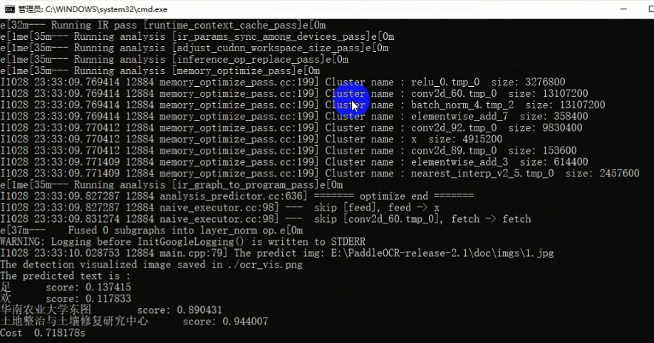

<div align = "center" style="font-size:40px;font-weight:bold">PaddleOCR C#部署</div>

<div align = "right" style="font-size:20px">By 深灰灰628</div>

<div align = "right" style="font-size:20px">2021.11.9</div>

------

[TOC]


## Step1：准备PaddleOCR，VS2019，Cmake，Opencv

### 1.1 PaddleOCR

略

### 1.2 VS2019

略

### 1.3 Cmake

本教程为[3.18](https://github.com/Kitware/CMake/releases/tag/v3.18.0)版本，其他版本并未测试。

### 1.4 OpenCV

1.4.1 根据[官方教程](https://github.com/PaddlePaddle/PaddleOCR/blob/dygraph/deploy/cpp_infer/docs/windows_vs2019_build.md)，安装[3.4.6](https://sourceforge.net/projects/opencvlibrary/files/3.4.6/opencv-3.4.6-vc14_vc15.exe/download)版本，并解压至相关路径，如`C:\Light Program`

1.4.2 配置环境变量，如下流程所示

- 我的电脑->属性->高级系统设置->环境变量

- 在系统变量中找到Path（如没有，自行创建），并双击编辑

- 新建，将opencv路径填写并保存，如`C:\Light Program\OpenCV\3.4.6\opencv\build\x64\vc15\bin`

  

### 1.5 Windows预测库

[官网下载预测库](https://paddleinference.paddlepaddle.org.cn/user_guides/download_lib.html#windows)，本例程以2.1.1为例


### 1.6 推理模型库下载

[官网](https://github.com/PaddlePaddle/PaddleOCR/blob/release/2.0/README_ch.md)下载检测，方向，识别对应的推理模型


### 1.7 将1.5，1.6下载的东西整理在一起，方便使用


## Step2：Cmake

### 2.1 Configure

2.1.1 选择本地paddleOCR内cpp_infer的路径，并选择生成文件的路径，完成后，点击Configure


2.1.2 如果报错如下信息，请先安装Git，[参考文档](https://www.cnblogs.com/ximiaomiao/p/7140456.html)


### 2.2 CmakeLists.txt

打开paddleOCR内的cpp_infer文件夹，打开CmakeLists.txt，在首行添加`cmake_minimum_required(VERSION 3.18)`，后面的版本号依据自己Cmake的版本来确定


### 2.3 Generate

2.3.1 本教程是CPU部署，所以只需要配置OPENCV_DIR，Opencv_DIR，PADDLE_LIB（1.5的windows预测库）。如果需要用GPU，需要填写CUDA地址


2.3.2 Generate后，如下信息则表示成功生成，其中4行报错信息先不管。生成的文件在cpp_infer下的build文件夹内


## Step3：VS2019编译Dll

### 3.1 ocr_system.sln

VS2019打开cpp_infer下的build文件夹内ocr_system.sln

### 3.2 重新生成

ocr_system，右击->重新生成，看下报错信息


### 3.3 表达式必须含有常量/表达式的计算结果不是常数


报错代码：

```
char strs[str.length() + 1];
```

更换成：

```
int strlen = str.length() + 1; 

char *strs = new char[strlen];
```


报错代码：

```
char d[delim.length() + 1];
```

更换成：

```
int delimlen = delim.length() + 1; 

char *d = new char[delimlen];
```

参考文档：https://blog.csdn.net/qq_15751687/article/details/120330037?utm_medium=distribute.pc_relevant.none-task-blog-2%7Edefault%7Eessearch%7Evector-12.no_search_link&depth_1-utm_source=distribute.pc_relevant.none-task-blog-2%7Edefault%7Eessearch%7Evector-12.no_search_link


### 3.4 无法打开包含文件：‘’‘dirent.h’


3.4.1 下载[dirent.h](https://github.com/tronkko/dirent)


3.4.2 打开cpp_infer内的include文件夹，将下载的dirent.h复制进来


3.4.3 更改引用路径

原引用路径：

```
#include <dirent.h>
```

更改成：

```
#include <include/dirent.h>
```


参考文档：https://blog.csdn.net/stq054188/article/details/118683950


### 3.5 C3861 “lstat”: 找不到标识符


原代码

```
lstat(dir_name, &s);
```

更改成：

```
stat(dir_name, &s);
```


参考文档：https://blog.csdn.net/stq054188/article/details/118683950


### 3.6 LNK2038: 检测到“RuntimeLibrary”的不匹配项 

在工程上右键->属性->c/c++->代码生成->运行库
有四个选项及含义分别如下：
多线程调试Dll (/MDd) 对应的是MD_DynamicDebug
多线程Dll (/MD) 对应的是MD_DynamicRelease
多线程(/MT) 对应的是MD_StaticRelease
多线程(/MTd)对应的是MD_StaticDebug


参考：https://blog.csdn.net/liukang325/article/details/78584625

### 3.7 重新生成

ocr_system，右击->重新生成，显示“全部重新生成已成功”。并在cpp_infer->build->Release下，生成ocr_system.exe

 


## Step4：cmd执行exe

### 4.1 解压模型

解压1.6内的检测，方向，识别推理模型


### 4.2 config.txt

打开cpp_infer下的tools文件夹，打开config.txt


### 4.3 config.txt配置

更改det_model_dir，cls_model_dir，rec_model_dir，这三个路径见1.7。char_list_file为字典路径，visualize为结果是否可视化，如下

```
det_model_dir  E:\PaddleOCR-release-2.1\download\ch_ppocr_mobile_v2.0_det_infer

cls_model_dir  E:\PaddleOCR-release-2.1\download\ch_ppocr_mobile_v2.0_cls_infer

rec_model_dir  E:\PaddleOCR-release-2.1\download\ch_ppocr_mobile_v2.0_rec_infer
char_list_file  E:\PaddleOCR-release-2.1\ppocr\utils\ppocr_keys_v1.txt

visualize 1
```

### 4.4 paddle_inference.dll

将1.5中的Windows预测库内的paddle_inference.dll，复制到ocr_system.exe所在目录。如不复制，将报错


### 4.5 cmd

打开cmd，cd到ocr_system.exe所在目录


### 4.6 CHCP 65001

先输入命令行`CHCP 65001` 执行，否则会出现中文乱码


### 4.7 执行

选择config.txt路径，待测图像路径，执行如下命令

```
ocr_system.exe E:\PaddleOCR-release-2.1\deploy\cpp_infer\tools\config.txt E:\PaddleOCR-release-2.1\doc\imgs\1.jpg
```


### 4.8 结果显示




## step5：重编辑main.cpp

### 5.1 将如下代码替换原有main.cpp的代码


```
#include "glog/logging.h"
#include "omp.h"
#include "opencv2/core.hpp"
#include "opencv2/imgcodecs.hpp"
#include "opencv2/imgproc.hpp"
#include <chrono>
#include <iomanip>
#include <iostream>
#include <ostream>
#include <vector>

#include <cstring>
#include <fstream>
#include <numeric>

#include <include/config.h>
#include <include/ocr_det.h>
#include <include/ocr_rec.h>
//#include"ocr.h"
using namespace std;
using namespace cv;
using namespace PaddleOCR;

/*
1.返回框选字体；
2.返回解析字符串
*/

extern "C" __declspec(dllexport) void LoadModel(char* img_path,char* OcrConfig_path, char* rec_result, int& rec_result_len, int* sss, int& sss_len);

__declspec(dllexport) void LoadModel(char* img_path, char* OcrConfig_path, char*     rec_result, int& rec_result_len, int* sss, int& sss_len)
{
    std::string str_ret;
auto start0 = std::chrono::system_clock::now();
//OCRConfig config("D:\\Paddle\\PaddleOCR-release-2.1\\deploy\\cpp_infer\\tools\\config.txt");
OCRConfig config(OcrConfig_path);
config.PrintConfigInfo();
auto end0 = std::chrono::system_clock::now();
auto duration0 =
    std::chrono::duration_cast<std::chrono::microseconds>(end0 - start0);
str_ret += "OCRConfig_Cost:";
str_ret += std::to_string(double(duration0.count()) *
    std::chrono::microseconds::period::num /
    std::chrono::microseconds::period::den);
str_ret += "s\r\n";

auto start1 = std::chrono::system_clock::now();
cv::Mat srcimg = cv::imread(img_path, cv::IMREAD_COLOR);
//cv::Mat srcimg(height, width, CV_8UC3, input);
auto end1 = std::chrono::system_clock::now();
auto duration1 =
    std::chrono::duration_cast<std::chrono::microseconds>(end1 - start1);
str_ret += "cv::imread_Cost:";
str_ret += std::to_string(double(duration1.count()) *
    std::chrono::microseconds::period::num /
    std::chrono::microseconds::period::den);
str_ret += "s\r\n";

auto start2 = std::chrono::system_clock::now();
DBDetector det(config.det_model_dir, config.use_gpu, config.gpu_id,
    config.gpu_mem, config.cpu_math_library_num_threads,
    config.use_mkldnn, config.max_side_len, config.det_db_thresh,
    config.det_db_box_thresh, config.det_db_unclip_ratio,
    config.use_polygon_score, config.visualize,
    config.use_tensorrt, config.use_fp16);
auto end2 = std::chrono::system_clock::now();
auto duration2 =
    std::chrono::duration_cast<std::chrono::microseconds>(end2 - start2);
str_ret += "DBDetector_Cost:";
str_ret += std::to_string(double(duration2.count()) *
    std::chrono::microseconds::period::num /
    std::chrono::microseconds::period::den);
str_ret += "s\r\n";

auto start3 = std::chrono::system_clock::now();
Classifier* cls = nullptr;
if (config.use_angle_cls == true) {
    cls = new Classifier(config.cls_model_dir, config.use_gpu, config.gpu_id,
        config.gpu_mem, config.cpu_math_library_num_threads,
        config.use_mkldnn, config.cls_thresh,
        config.use_tensorrt, config.use_fp16);
}
auto end3 = std::chrono::system_clock::now();
auto duration3 =
    std::chrono::duration_cast<std::chrono::microseconds>(end3 - start3);
str_ret += "Classifier_Cost:";
str_ret += std::to_string(double(duration3.count()) *
    std::chrono::microseconds::period::num /
    std::chrono::microseconds::period::den);
str_ret += "s\r\n";

auto start4 = std::chrono::system_clock::now();
CRNNRecognizer rec(config.rec_model_dir, config.use_gpu, config.gpu_id,
    config.gpu_mem, config.cpu_math_library_num_threads,
    config.use_mkldnn, config.char_list_file,
    config.use_tensorrt, config.use_fp16);
auto end4 = std::chrono::system_clock::now();
auto duration4 =
    std::chrono::duration_cast<std::chrono::microseconds>(end4 - start4);
str_ret += "CRNNRecognizer_Cost:";
str_ret += std::to_string(double(duration4.count()) *
    std::chrono::microseconds::period::num /
    std::chrono::microseconds::period::den);
str_ret += "s\r\n";

auto start5 = std::chrono::system_clock::now();
// 检测
std::vector<std::vector<std::vector<int>>> boxes;
det.Run(srcimg, boxes);
//获取det框的角点坐标
size_t index = 0;
for (size_t i = 0; i < boxes.size(); i++)
{
    std::vector<std::vector<int>>& boxI = boxes[i];
    for (size_t j = 0; j < 4; j++)
    {
        sss[index++] = boxI[j][0];
        sss[index++] = boxI[j][1];
    }
}
sss_len = index;
auto end5 = std::chrono::system_clock::now();
auto duration5 =
    std::chrono::duration_cast<std::chrono::microseconds>(end5 - start5);
str_ret += "det_Cost:";
str_ret += std::to_string(double(duration5.count()) *
    std::chrono::microseconds::period::num /
    std::chrono::microseconds::period::den);
str_ret += "s\r\n";

auto start = std::chrono::system_clock::now();
// 识别  
rec.Run(boxes, srcimg, cls, str_ret);

//总耗时
auto end = std::chrono::system_clock::now();
auto duration =
    std::chrono::duration_cast<std::chrono::microseconds>(end - start);
std::cout << "Cost  "
    << double(duration.count()) *
    std::chrono::microseconds::period::num /
    std::chrono::microseconds::period::den
    << "s" << std::endl;
str_ret += "rec_cost:";
str_ret += std::to_string(double(duration.count()) *
    std::chrono::microseconds::period::num /
    std::chrono::microseconds::period::den);
str_ret += "s";
strcpy(rec_result, str_ret.c_str());
rec_result_len = str_ret.size();
}
```

### 5.2 更改ocr_rec.cpp

原代码：

```
void CRNNRecognizer::Run(std::vector<std::vector<std::vector<int>>> boxes,
                         cv::Mat &img, Classifier *cls) {
```

更改成：

```
void CRNNRecognizer::Run(std::vector<std::vector<std::vector<int>>> boxes,
                         cv::Mat &img, Classifier *cls, std::string& result) {
```

### 5.3 更改ocr_rec.h

原代码：

```
void Run(std::vector<std::vector<std::vector<int>>> boxes, cv::Mat &img,
           Classifier *cls);
```

更改成：

```
void Run(std::vector<std::vector<std::vector<int>>> boxes, cv::Mat &img,
           Classifier *cls, std::string& result);
```

### 5.4 更改ocr_rec.cpp

原代码：

```
for (int i = 0; i < str_res.size(); i++) {
    std::cout << str_res[i];
}
std::cout << "\tscore: " << score << std::endl;
```

更改成：

```
for (int i = 0; i < str_res.size(); i++) {
    std::cout << str_res[i];
    result += str_res[i];
}
std::cout << "\tscore: " << score << std::endl;
result += "\tscore: ";
result += std::to_string(score);
result += "\r\n";
```

### 5.5 更改ocr_system属性


### 5.6 重新生成

ocr_system，右击->重新生成，显示“全部重新生成已成功”。并在cpp_infer->build->Release下，生成ocr_system.dll

 


## Step6：VS2019编写C#

### 6.1 创建C#工程

拖入button，picturebox，textbox，点“启动”，生成exe


### 6.2 X64

项目属性->生成中，“首选32位”前的勾去掉，并将目标平台选择“X64”，否则会报“system.badimageformatexception”错误


### 6.3 dll复制

6.3.1 cpp_infer->bulid->Release文件夹下的libiomp5md.dll 、mkldnn.dll、mklml.dll、ocr_system.dll、paddle_inference.dll复制到C#工程Debug文件夹下


6.3.2 将opencv bin文件夹内的opencv_world451.dll复制到C#工程Debug文件夹下。其中，451为软件版本


### 6.4 dll引用

C++生成的dll，属于非托管的dll，无法通过添加引用，添加引用会报错，如下图。只能通过DllImport方式导入，[参考文档](https://greambwang.blog.csdn.net/article/details/96422456?utm_medium=distribute.pc_relevant.none-task-blog-2%7Edefault%7ECTRLIST%7Edefault-2.no_search_link&depth_1-utm_source=distribute.pc_relevant.none-task-blog-2%7Edefault%7ECTRLIST%7Edefault-2.no_search_link)。

```bash
[DllImport("ocr_system.dll", EntryPoint = "LoadModel", SetLastError = true, CharSet = CharSet.Ansi)]
        static extern void LoadModel(byte[] img_path, byte[] OcrConfig_path, byte[] rec_result, ref int len, int[] boxs, ref int boxs_len);
```


### 6.5 Button

```bash
//图像路径
byte[] img_path = System.Text.Encoding.Default.GetBytes("E:\\PaddleOCR-release-2.1\\doc\\imgs\\1.jpg");
//config.txt路径
byte[] OcrConfig_path = System.Text.Encoding.Default.GetBytes("E:\\PaddleOCR-release-2.1\\deploy\\cpp_infer\\tools\\config.txt");
byte[] rec_result = new byte[9999];
int[] boxs = new int[999];

textBox1.Text = "";
Array.Clear(rec_result, 0, rec_result.Length);
Array.Clear(boxs, 0, boxs.Length);
int boxs_len = -1;
int rec_result_len = -1;

//运行paddleocr
LoadModel(img_path, OcrConfig_path, rec_result, ref rec_result_len, boxs, ref boxs_len);  

//rec结果显示
textBox1.Text = Encoding.UTF8.GetString(rec_result);

//det结果显示
pictureBox1.Image = Image.FromFile("E:\\PaddleOCR-release-2.1\\doc\\imgs\\1.jpg");//图像路径
Bitmap Img = new Bitmap(pictureBox1.Image);
Graphics g = Graphics.FromImage(Img);
Pen greenPen = new Pen(Color.Aqua, 8);
if (boxs_len > 0)
{
	for (int i = 0; i < Math.Floor((double)boxs_len / 8.0); i++)
		{
			Point point1 = new Point(boxs[i * 8], boxs[i * 8 + 1]);
            Point point2 = new Point(boxs[i * 8 + 2], boxs[i * 8 + 3]);
            Point point3 = new Point(boxs[i * 8 + 4], boxs[i * 8 + 5]);
            Point point4 = new Point(boxs[i * 8 + 6], boxs[i * 8 + 7]);
            Point[] curvePoints = { point1, point2, point3, point4 };
            g.DrawPolygon(greenPen, curvePoints);
            pictureBox1.Image = Img;
         }
}
```

### 6.6 运行


## 感谢

https://github.com/chccc1994/PaddleOCR-Csharp-Deploy/blob/main/PaddleOCR%E6%96%87%E5%AD%97%E8%AF%86%E5%88%ABC%23%E9%83%A8%E7%BD%B2-1.md
